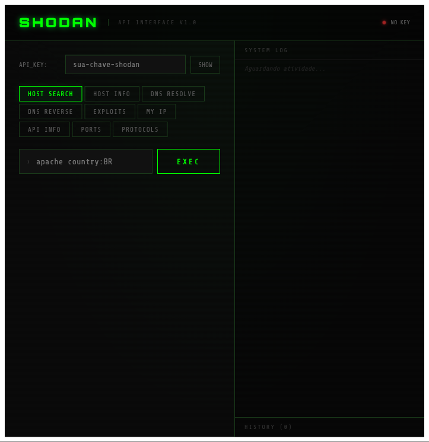

# Shodan Geo Search


Aplicação web com backend em Node.js/Express e frontend em HTML, CSS e JavaScript vanilla para buscar dispositivos por geolocalização usando a API do Shodan.

## Funcionalidades

- 🔍 Busca de dispositivos por latitude, longitude e raio
- 📍 Busca de CEP brasileiro com preenchimento automático de coordenadas
- 🌐 Geolocalização do usuário
- 🎨 Interface responsiva e moderna
- 📊 [Dashboard avançado](#dashboard-avancado) com visualização de dados
- 🐙 Suporte a Docker
- ✅ Testes E2E com Jest
- 🔒 Segurança: API key protegida via variáveis de ambiente

## Demo

Acesse: https://shodan.proframos.com

## Como usar

### Local

1. Clone o repositório:
   ```bash
   git clone https://github.com/prof-ramos/shodan-geo-search.git
   cd shodan-geo-search
   ```

2. Instale as dependências:
   ```bash
   npm install
   ```

3. Configure a API key:
   ```bash
   cp .env.example .env
   # Edite .env e adicione sua SHODAN_API_KEY
   ```

4. Rode a aplicação:
   ```bash
   npm start
   ```

5. Acesse `http://localhost:3000`

### Como usar a busca por CEP

1. Digite o CEP desejado no campo "CEP" (ex: `70040-020` para Brasília)
2. O sistema formatará automaticamente para `XXXXX-XXX`
3. Ao completar 8 dígitos, a busca é automática via AwesomeAPI
4. Os campos de latitude e longitude serão preenchidos
5. Uma mensagem de sucesso mostrará a localização encontrada
6. Ajuste o raio de busca e clique em "Buscar dispositivos"

**CEPs de exemplo:**
- `70040-020` - Brasília, DF
- `01310-100` - São Paulo, SP
- `20040002` - Rio de Janeiro, RJ (pode ser digitado com ou sem hífen)

## Dashboard avançado

O dashboard avançado fica disponível na rota `/dashboard`. Em ambiente local, acesse `http://localhost:3000/dashboard` depois de iniciar o servidor; não há autenticação adicional hoje, então qualquer usuário com acesso à aplicação consegue abrir a interface.

Ele expõe uma interface dedicada para consultas diretas na API do Shodan com foco em exploração e triagem rápida. A tela reúne:

- busca por `Host Search`, `Host Info`, `DNS Resolve`, `DNS Reverse`, `Exploits`, `My IP`, `API Info`, `Ports` e `Protocols`
- histórico das últimas consultas executadas
- painel de logs com requisição, resposta e mensagens de erro
- visualização dos campos mais relevantes retornados pelo Shodan, como IP, portas, organização, localização, hostnames e vulnerabilidades

Fluxo de uso sugerido:

1. Abra `/dashboard`
2. Informe sua API key do Shodan no topo da tela
3. Escolha o endpoint desejado
4. Preencha a query quando o endpoint exigir parâmetros
5. Clique em `EXEC` para inspecionar a resposta e o histórico


_Dashboard avançado com seleção de endpoint, campo de API key, histórico e visualização dos resultados retornados pela API._

### Docker

```bash
# Build
docker build -t shodan-geo .

# Run
docker run -p 3000:3000 -e SHODAN_API_KEY=sua_chave shodan-geo
```

## Testes

```bash
# Rodar testes
npm test

# Rodar com watch
npm run test:watch
```

**Cobertura atual:** suíte automatizada cobrindo backend Express e assets estáticos.

## Estrutura do Projeto

```
shodan-geo-search/
├── public/
│   ├── index.html      # Interface principal
│   ├── styles.css      # Estilos responsivos
│   └── script.js       # Lógica do frontend
├── tests/
│   └── server.test.js  # Testes E2E
├── server.js           # Backend Express
├── package.json        # Dependências
├── Dockerfile          # Container config
└── .env.example        # Template de ambiente
```

## API

### Busca por CEP (Frontend)

Utiliza a **AwesomeAPI** para consultar CEPs brasileiros e obter coordenadas geográficas.

**Endpoint:** `https://cep.awesomeapi.com.br/json/{cep}`

**Exemplo de resposta:**
```json
{
  "cep": "70040020",
  "address_type": "SBN",
  "address_name": "Quadra 2",
  "state": "DF",
  "district": "Asa Norte",
  "lat": "-15.7879644",
  "lng": "-47.8789222",
  "city": "Brasília"
}
```

### POST /api/search

Busca dispositivos por geolocalização.

**Request:**
```json
{
  "latitude": -23.5505,
  "longitude": -46.6333,
  "radius": 25
}
```

**Response:**
```json
{
  "devices": [
    {
      "ip": "192.168.1.1",
      "organization": "Example Org",
      "port": 80
    }
  ]
}
```

## Tecnologias

- **Backend:** Node.js, Express
- **Frontend:** HTML5, CSS3, JavaScript (Vanilla)
- **Testes:** Jest, Supertest
- **APIs:** Shodan API, AwesomeAPI (CEP)
- **Deploy:** Docker, Traefik

## Obtendo uma API Key do Shodan

1. Acesse https://www.shodan.io
2. Crie uma conta gratuita
3. Vá em https://developer.shodan.io/api
4. Copie sua API Key

## Licença

MIT

## Autor

**Gabriel Ramos**
- GitHub: [@prof-ramos](https://github.com/prof-ramos)
- Website: https://proframos.com
